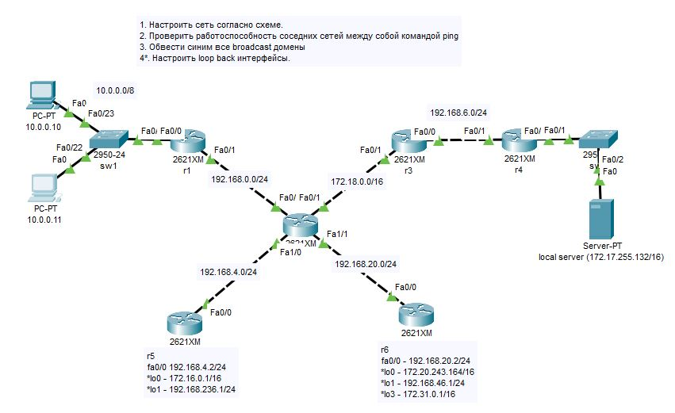
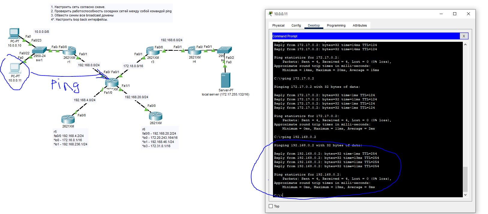
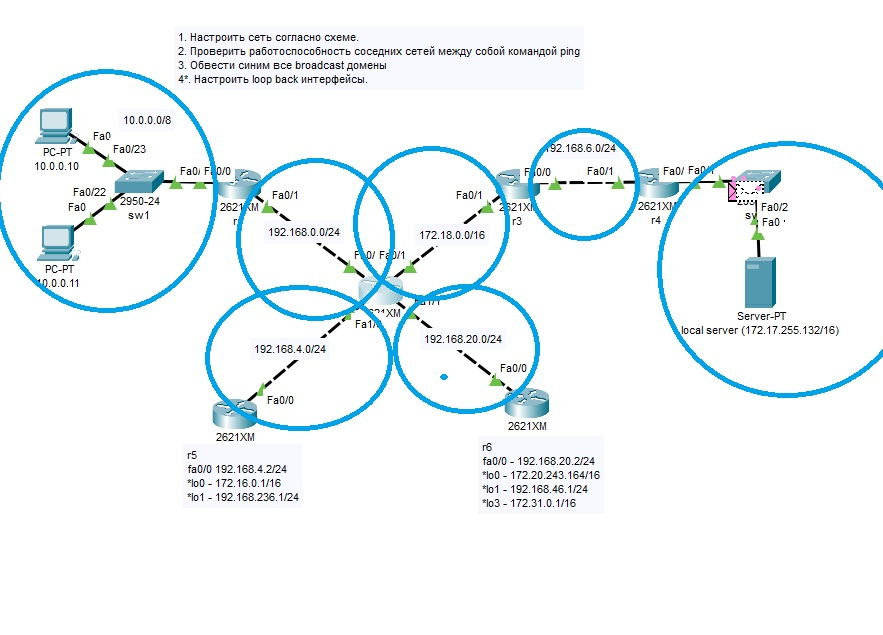
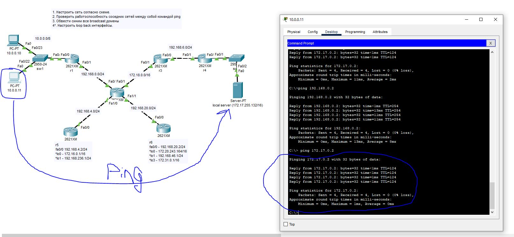
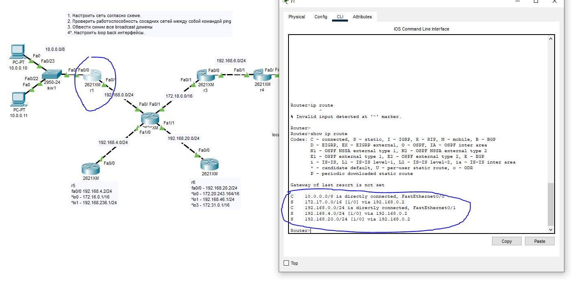
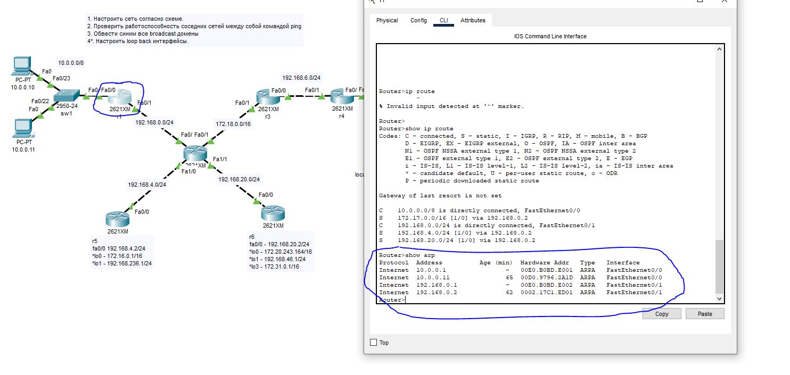

# 1. Настроить сеть согласно схеме в файле

# 2. Проверить работоспособность соседних между собой сетей командой ping.

# 3. Обвести синим все broadcast домены

# 4*. Настроить loopback интерфейсы.

## вывод любой таблицы ARP

