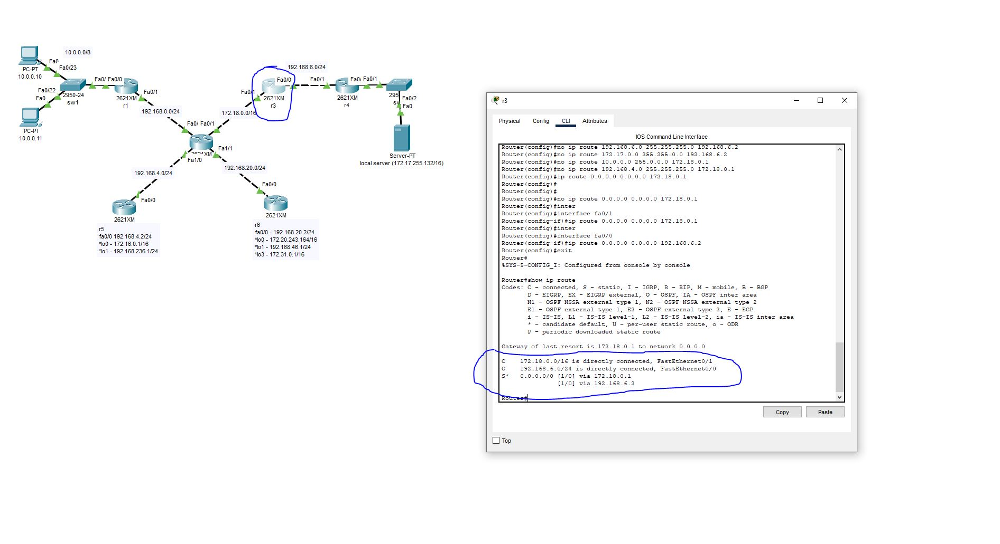
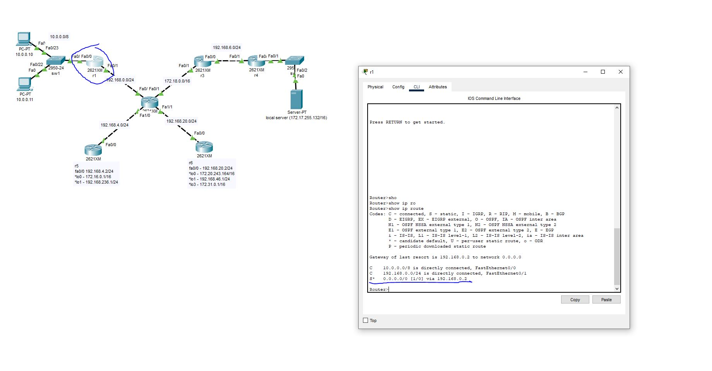
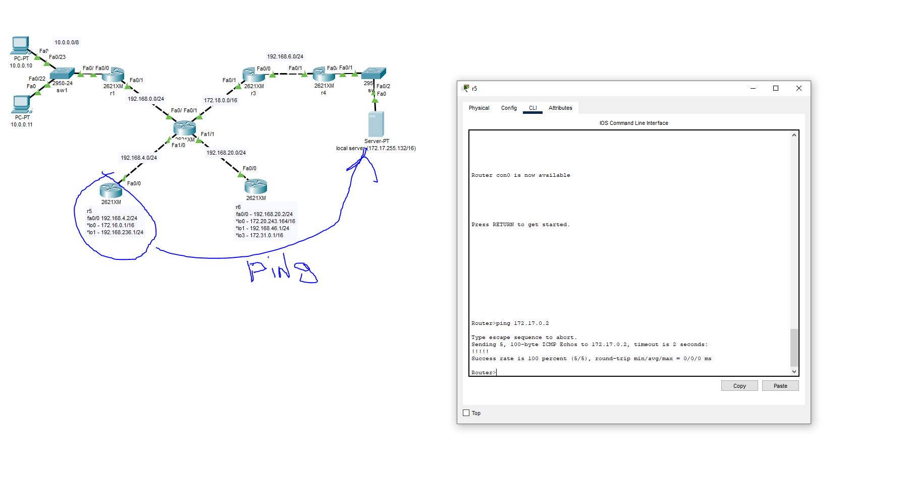
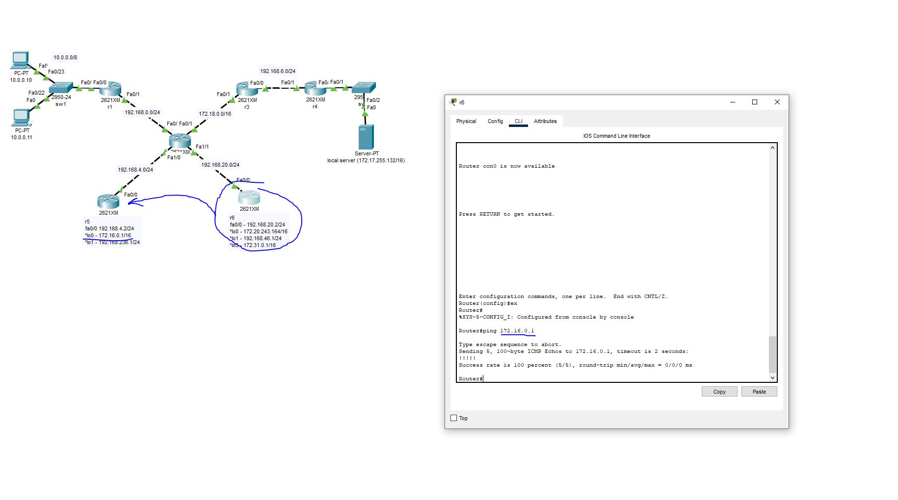
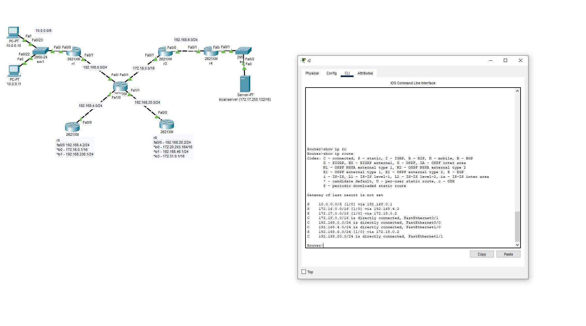
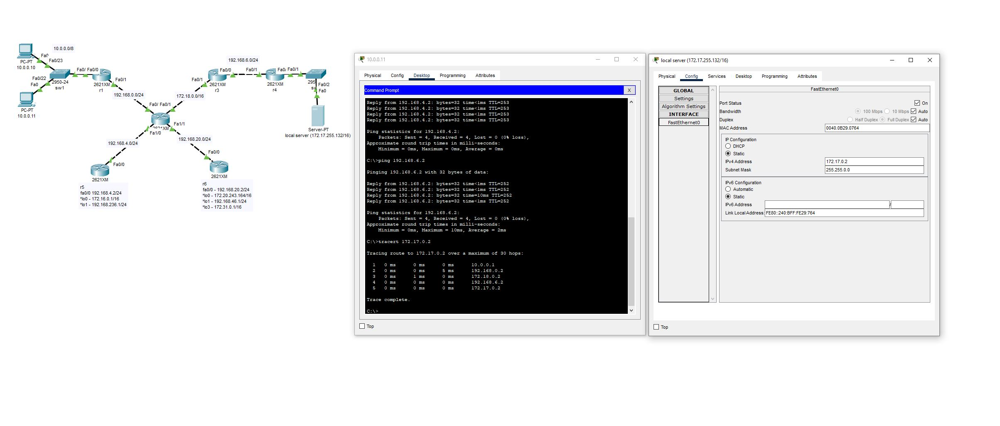
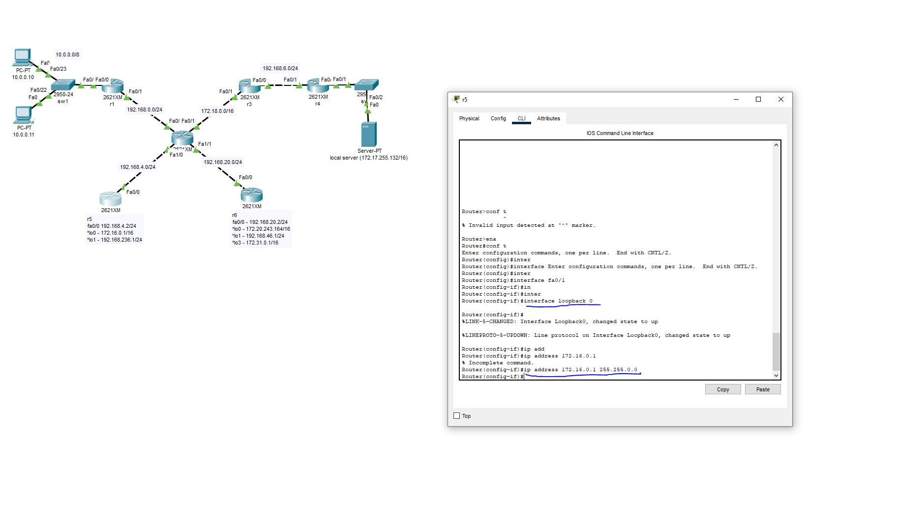
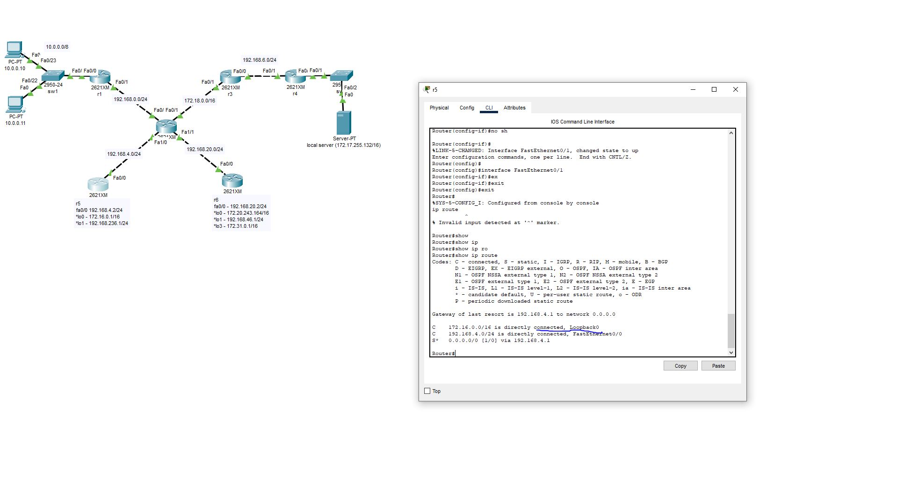

# 1. Усложняем сеть из предыдущего домашнего задания.   Используя только статическую маршрутизацию связать сеть компов и сервера

Настроил это в прошлом дз 
<a href = "https://github.com/PEBU3OP1/Networks/tree/main/HW2">Ссылка на прошлое ДЗ</a>

Поэтому в этом решил некоторым маршрутизаторам прописать дефолтные маршруты

# 2. Проверить работоспособность сети командой ping с компов до сервера и обратно
## 2.1* Попробовать настроить статику так, чтобы пинговались все интерфейсы отовсюду.

Пингуется абсолютно все. Пример

Пинг loopback адреса

# 3. Изучить получившиеся таблицы маршрутизации

# 4. Попрактиковаться в использовании команды tracert

# 6*. Настроить loop back интерфейсы, статику до них и они тоже должны пинговаться
(Задание со * и * являются заданиями с повышенной сложностью. Если они не выполнены, это не влияет на оценку).

Пинг одного из loopback адресов

Настройка Loopback адреса

