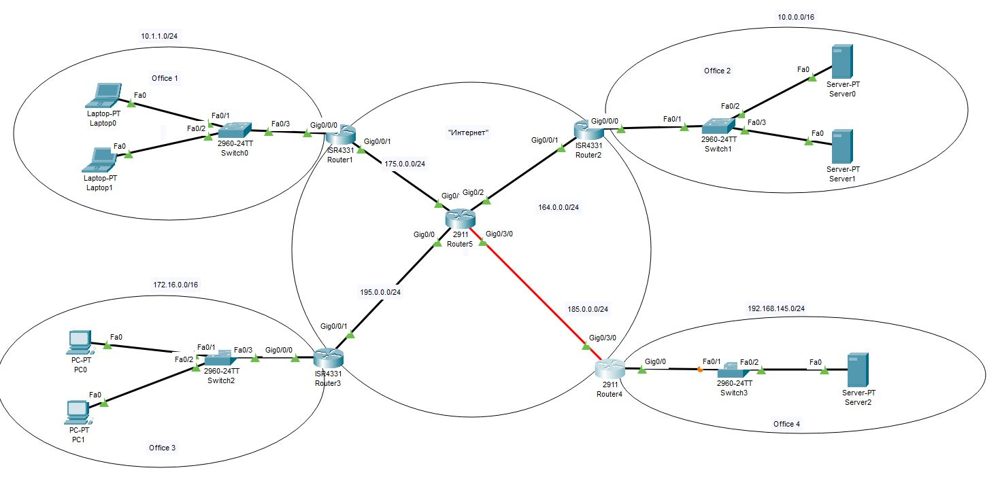

## Задача 1. 
Настроить сеть согласно схеме в файле, где:
Office 1 - cеть 10.1.1.0/24 
Office 2 - cеть 10.0.0.0/16 
Office 3 - cеть 172.16.0.0/16 
Office 4 - cеть 192.168.145.0/24 
Где “Интернет” - там имитация Интернета с помощью OSPF, выберите сами публичные сети между роутерами.

## Задача 2. 
Настроить на Port Forwarding на сервера в Office 2. Server0 должен предоставлять HTTP по 80му порту, а Server1 должен предоставлять HTTPS по 443 порту. Странички должны быть разные.

## Задача 3. 
Настроить PAT в Office 3 для компьютеров, чтобы они выходили в интернет под одним публичным IP адресом на Router1.

## Задача 4. 
Связать сети Office 1 и Office 4 с помощью GRE. Предоставит трейс с Laptop0 до Server2.

