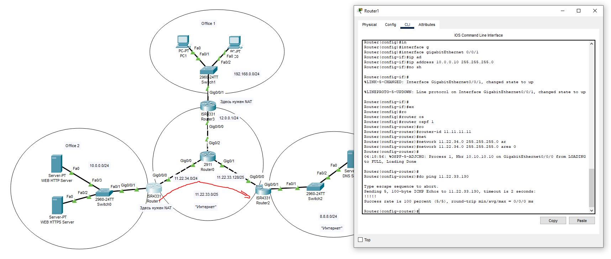
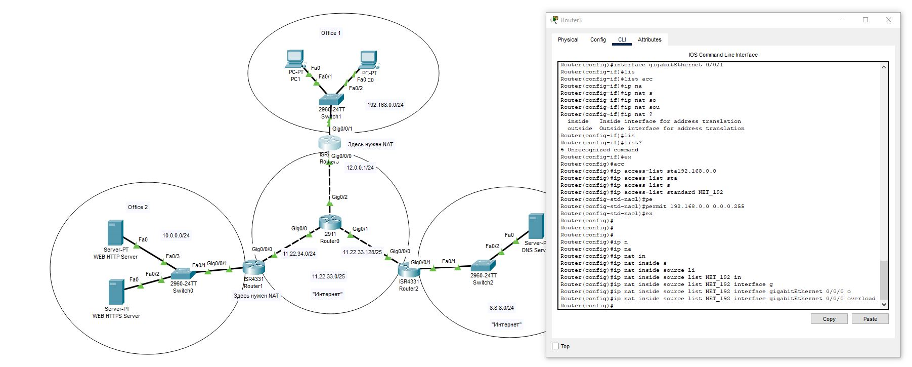
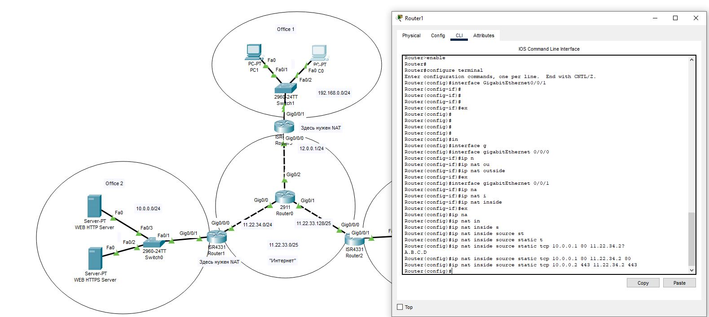
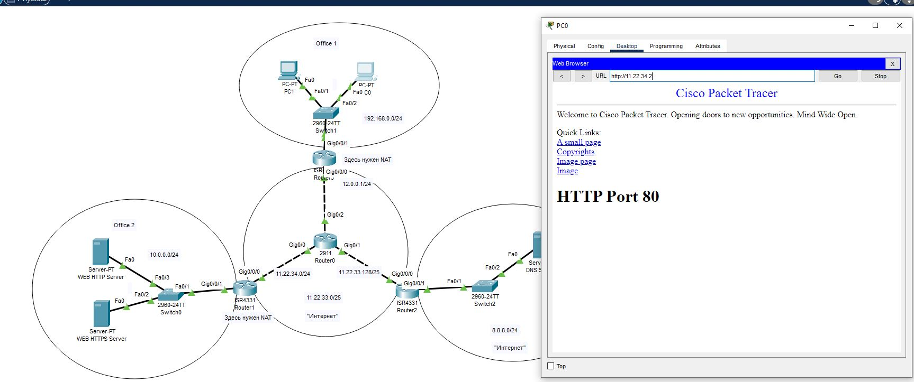
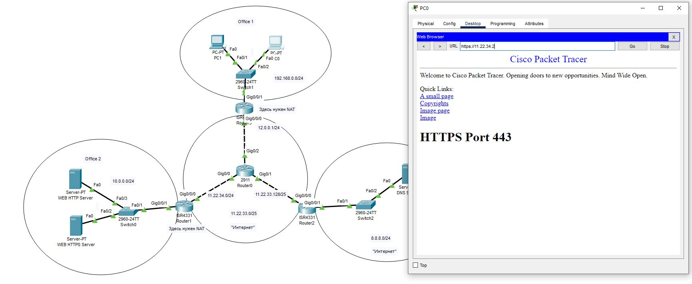
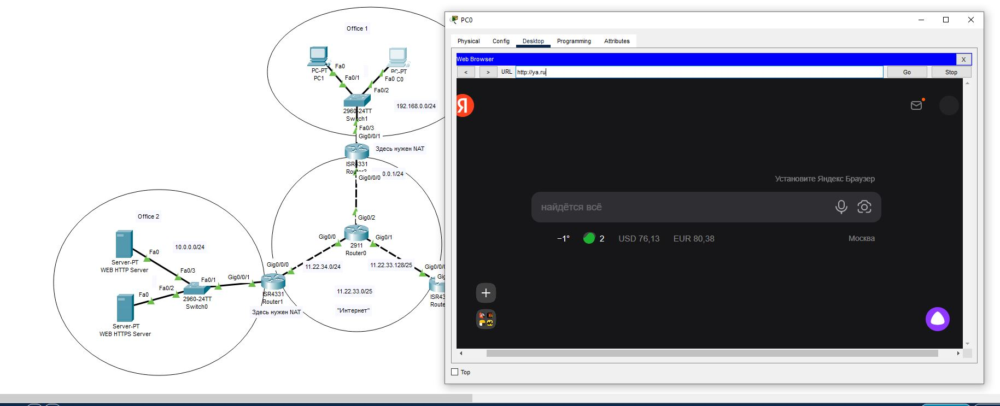
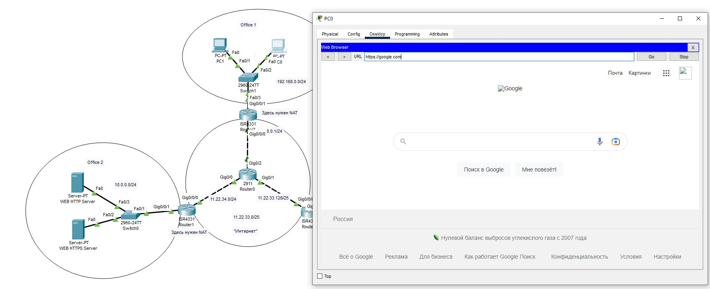
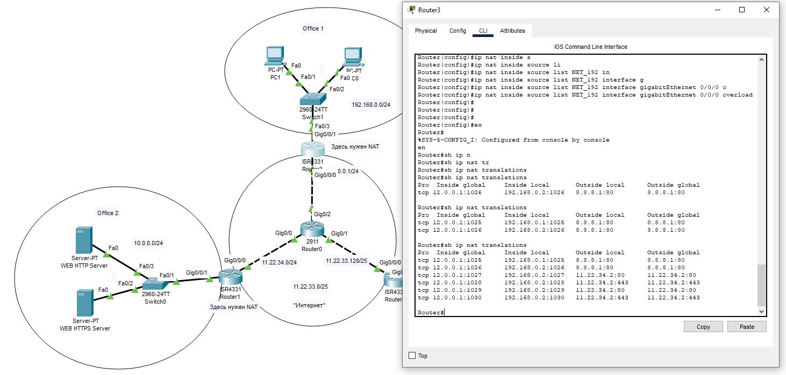
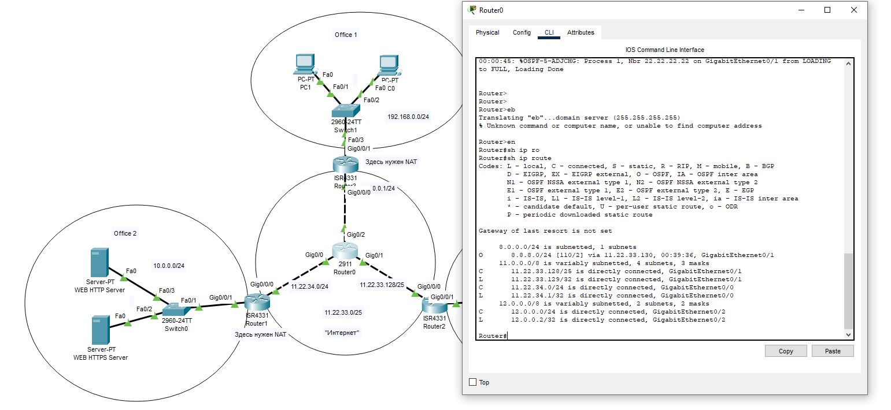

## 1. Сымитировать "Интернет" с помощью OSPF. Приватных сетей в маршрутизации быть не должно.

## 2. Для компьютеров из Office 1 предоставить доступ в "Интернет" с помощью PAT.

## 3. Открыть доступ из "Интернета" к серверам из Office 2 c помощью Port Forwarding.

## 4. Для компьютеров из Office 1 должны открываться разные сайты по HTTP и HTTPS из Office 2 по одному доменному имени.

## 5. Предоставить скриншоты открытых разных сайтов по одному доменному имени.
На всякий случай еще настроил через DNS

## 6. Предоставить скриншот таблицы NAT трансляций с Router3.

## 7. Предоставить скриншот таблицы маршрутизации с Router0.
